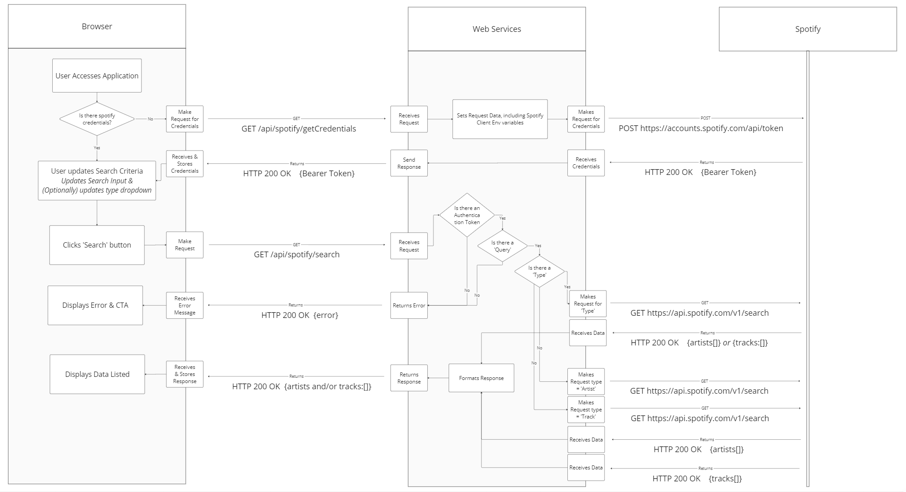

# JAM Session

A web application where u sers can search for artists, tracks or both at the same time to create momentary playlists to share with friends, built with flask and vite.

- When artists are returned from a search they can be clicked to create a new search for tracks by that particular artist.
- When tracks are returned from a search, user can choose to add the track to their current session playlist that is then stored locally

##### Stack

- yarn
- Vite & React
- DaisyUI & TailwindCSS
- Flask & Python
- Spotify API
- Postman
- Docker

## Setup

  
<b>Requirements</b>

- [Node ^v20](https://nodejs.org/en/download)
- [Python ^v3.10](https://www.python.org/downloads/)
- [yarn](https://classic.yarnpkg.com/lang/en/docs/install/#windows-stable)
- [git](https://git-scm.com/book/en/v2/Getting-Started-Installing-Git)
- [Docker Desktop](https://www.docker.com/products/docker-desktop/)
- [Postman CLI](https://learning.postman.com/docs/postman-cli/postman-cli-installation/)

1. Install the following items to your local:

   - [Node ^v20](https://nodejs.org/en/download)
   - [Python ^v3.10](https://www.python.org/downloads/)
   - [yarn](https://classic.yarnpkg.com/lang/en/docs/install/#windows-stable)
   - [git](https://git-scm.com/book/en/v2/Getting-Started-Installing-Git)
   - [Docker Desktop](https://www.docker.com/products/docker-desktop/)
   - [Postman CLI](https://learning.postman.com/docs/postman-cli/postman-cli-installation/)

2. Clone Repo and run `yarn install`

**Run Dev Locally**

1. Open new terminal & navigate to `jam-session` folder
2. Run `yarn start-api`, _api viewable on port 5000 || 8000/api_
3. Open separate new terminal & navigate to `jam-session` folder
4. Run `yarn dev`, _application viewable on port 8000_

**Run Containerized Application Locally**

1. Open new terminal & navigate to `jam-session` folder
2. Run `yarn docker:start`,
   - _application viewable on port 8000_
   - _api viewable on port 5000 || 8000/api_

## Testing API

API tests are created using Postman

View the collection in the [Postman Workspace](https://red-crater-415714.postman.co/workspace/red-crater-415714-Workspace~afb4e357-8441-4776-8fd5-a64624e84cf7/api/6ad7dda1-8c59-4665-96e3-bc70821e1545/integrations/ci/configure-postman-cli?rule=local) _(optional)_

To run tests locally:

1. Open new terminal & navigate to `jam-session` folder
2. Run `yarn test:api`

## Workflow Block Diagram

[View diagram on it's own](./docs/JamSession-blockDiagram.PNG)

